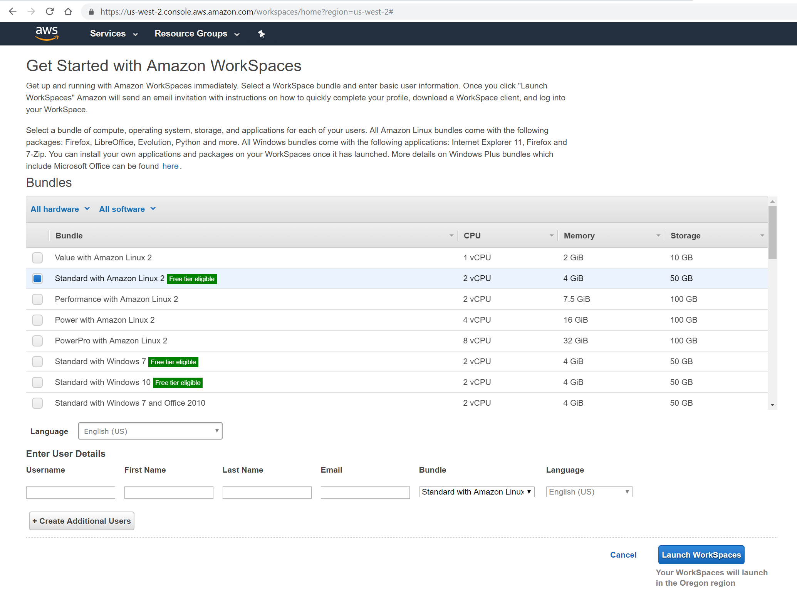
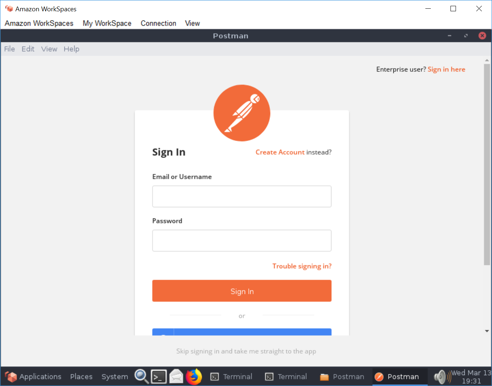
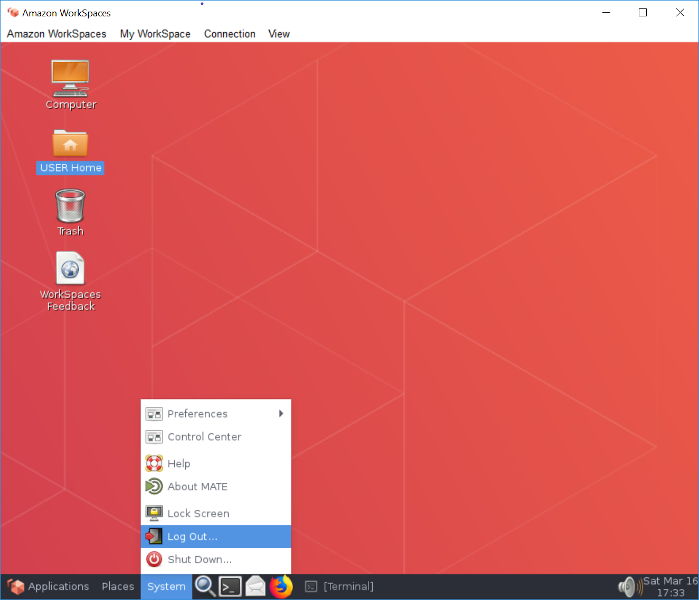
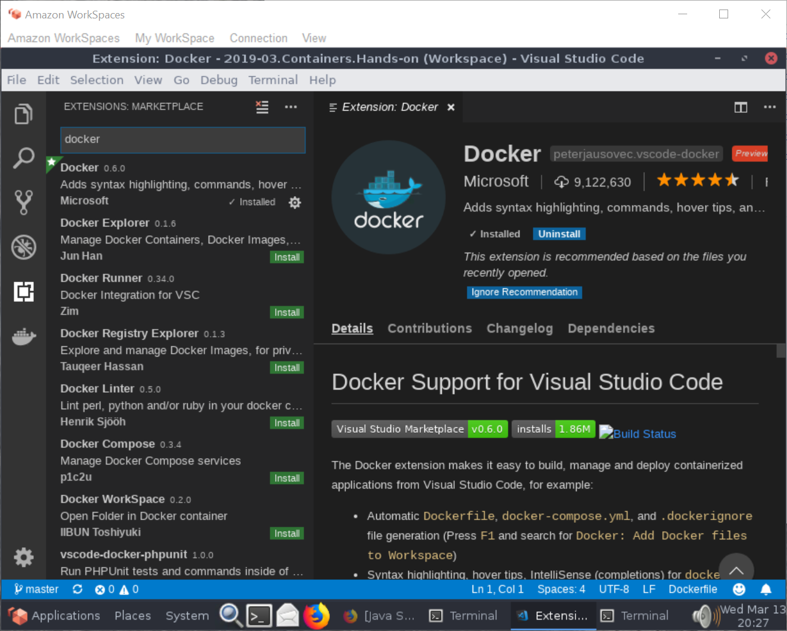

# Setup an Amazon Linux Developer WorkSpace

Setup instruction for software development - Copyright (c) 2019-03 by Alisson Sol

## 01) Provision an Amazon Linux WorkSpace

Instructions at [Get Started with Amazon WorkSpaces Quick Setup](https://docs.aws.amazon.com/workspaces/latest/adminguide/getting-started.html) present the steps to be followed.

It took just 30 minutes between the time I created a free AWS account and the time I got a running Amazon Linux WorkSpace.

Used option:
- Standard with Amazon Linux 2 (Free tier elegible) : 2 vCPU : 4 GiB Memory

See snapshot below.


I've previous downloaded an [image of Amazon Linux for the Hyper-V in Windows](https://cdn.amazonlinux.com/os-images/latest/hyperv/). Just the time to download and uncompress that image it was the same as the time to launch the fully ready desktop in the cloud.

You can also provision Windows bundles in the free tier.

For any bundle, the next step is to [download the WorkSpaces client](https://clients.amazonworkspaces.com/) and connect to your cloud desktop. 

Two potentially time-saving warnings:
1) Pay attention to your SPAM folder for a message from Amazon WorkSpaces with a link for you to complete your profile and define a password for your user.
2) Your cloud desktop registration code is in the message your receive. It is also in the AWS Console. It is not the "WorkSpace ID". Expand the "WorkSpace ID" line in order to see the "Registration Code" used in the client.

## 02) Install the JDK

My Amazon Linux cloud desktop had Java already installed, but not the development kit. Instructions, based on [How to install Java on CentOS 7](https://linuxize.com/post/install-java-on-centos-7/) are:

```
$ sudo yum -y install java-1.8.0-openjdk-devel
$ java -version
$ javac -version
$ export JAVA_HOME=/etc/alternatives/java_sdk_openjdk
```

You may also benefit from adding JAVA_HOME to /etc/bashrc

## 03) Install .NET Core

For those who want to work on .NET, following instructions to [Install .NET Core SDK on Linux CentOS / Oracle x6](https://dotnet.microsoft.com/download/linux-package-manager/centos/sdk-current)

Basic commands are:
```
$ sudo rpm -Uvh https://packages.microsoft.com/config/rhel/7/packages-microsoft-prod.rpm
$ sudo yum -y update
$ sudo yum -y install dotnet-sdk-2.2
$ dotnet --version
```

## 04) Install Git

For version control, I use git. It was there already in the cloud desktop. Just in case, here are the install instructions:

```
$ sudo yum -y install git
$ git --version
```

## 05) Install Postman

Postman really helps when developing APIs, sites, testing authentication, etc. Download [Postman](https://www.getpostman.com/downloads/). Then uncompress, add to a folder and optionally add that folder to the PATH. In order to check the installation, start Postman and create or sign-up to your account (picture below).


## 06) Install Docker
  
Allow work with containers.

Basic commands are:
```
$ sudo yum -y install docker
$ sudo docker --version
```

And in order to avoid having to run docker with `sudo` all the time:
```
$ sudo groupadd docker
$ sudo usermod -aG docker $USER
```

It is recommended that you follow the [Post-installation steps for Linux])(https://docs.docker.com/install/linux/linux-postinstall/). Mainly, that you logout and login again, and then set docker to start after reboots and test it starting a Hello World instance.

```
$ sudo systemctl enable docker 
$ sudo systemctl start docker
$ docker run hello-world
```

If that last command fails, remember to logout (menu System->Log Out) and connect again.



Depending on images you will use during development, you may need to sign-up for an account in the [Docker Hub registry](https://hub.docker.com/signup). It is recommended to proactively do that.

## 07) Install Docker Compose
  
Follow the instructions to [Install Docker Compose](https://docs.docker.com/compose/install/).

Basic commands are:
```
$ sudo curl -L "https://github.com/docker/compose/releases/download/1.23.2/docker-compose-$(uname -s)-$(uname -m)" -o /usr/local/bin/docker-compose
$ sudo chmod +x /usr/local/bin/docker-compose
$ sudo ln -s /usr/local/bin/docker-compose /usr/bin/docker-compose
$ docker-compose --version
```

## 08) Install Traefik

The software NLB used for experiments, and configuration.

Follow article [How To Use Traefik as a Reverse Proxy for Docker Containers on CentOS 7](https://www.digitalocean.com/community/tutorials/how-to-use-traefik-as-a-reverse-proxy-for-docker-containers-on-centos-7)

# 09) Install Maven

The build package to be used to build the projects. Install commands are:

```
$ sudo yum -y install maven
$ mvn -version
```

# 10) Install Visual Studio Code

Basic commands are:
```
$ sudo rpm --import https://packages.microsoft.com/keys/microsoft.asc
$ sudo sh -c 'echo -e "[code]\nname=Visual Studio Code\nbaseurl=https://packages.microsoft.com/yumrepos/vscode\nenabled=1\ngpgcheck=1\ngpgkey=https://packages.microsoft.com/keys/microsoft.asc" > /etc/yum.repos.d/vscode.repo'
$ sudo yum -y install code
```

Follow instructions for [Managing Extensions in Visual Studio Code](https://code.visualstudio.com/docs/editor/extension-gallery) and install useful extensions, like:
- Maven for Java
- Docker (picture below)



# Test if everything works...

At the end of the process, it is required to at least logout and login again, so the membership credentials are refreshed.

Would recommend also a reboot, in order to make sure configuration is persisted.
```
$ sudo shutdown -r now
```

After the reboot and reconnection, open a terminal and check every package installed is still accessible.

```
$ javac -version
$ dotnet --version
$ git --version
$ docker --version
$ docker-compose --version
$ mvn -version
$ code
```

You should now have a Visual Studio Code window open. The cloud desktop is ready for coding.