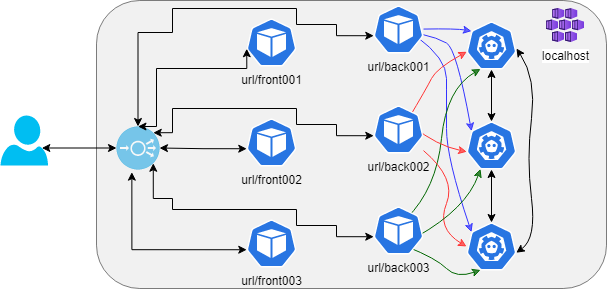

# Deployment

Below are the instructions for deployment using the [`yuruna`](https://bit.ly/asol-yrn) framework. Check documentation for that framework for [requirements](https://github.com/alissonsol/yuruna/blob/main/docs/requirements.md) and for how to [authenticate](https://github.com/alissonsol/yuruna/blob/main/docs/authenticate.md) when doing a cloud-based deployment.

Include the `automation` folder in the path. Then deploy resources, build components, and install workloads. Below are the end-to-end steps to deploy the `cloudtalk` example to `localhost` (assuming Docker is installed and Kubernetes enabled). The execution below is from the `automation` folder.

**NOTE**: If rerunning the scripts the recommendation is to use the "Reset to factory defaults" settings for Docker and start Kubernetes again, avoiding any collision of port bindings with previous deployments.

**IMPORTANT**: Before proceeding, read the Connectivity section of the [Frequently Asked Questions](../../../docs/faq.md).

- Create resources

```shell
./yuruna.ps1 resources ../examples/cloudtalk localhost
```

- Build the components

```shell
./yuruna.ps1 components ../examples/cloudtalk localhost
```

- Deploy the  workloads

Before deploying workloads in the `localhost`, read the special note on [ingress issues in a localhost](../../../docs/ingress-localhost.md).

```shell
./yuruna.ps1 workloads ../examples/cloudtalk localhost
```

Deploying to Azure just requires replacing `localhost` with `azure` in the commands above. Remember to [authenticate](https://github.com/alissonsol/yuruna/blob/main/docs/authenticate.md) beforehand.

NOTE: After deploying to Azure, you need to open communication ports across the Internet in each cluster. Automation coming...

## Connections

The scripts automate the steps to deploy components and expose services, as explained in the MSDN article [Up and Running with Azure Kubernetes Services](https://docs.microsoft.com/en-us/archive/msdn-magazine/2018/december/containers-up-and-running-with-azure-kubernetes-services).

### Localhost connections - ironrslkv

In a localhost, using connected [IronRSLKVServer](https://github.com/microsoft/Ironclad/tree/main/ironfleet/src/IronRSLKVServer) nodes, all the components run in the same cluster. The collision is solved by different pathBase values for each instance. A difference is that each backend knows about all the RSL key-value servers.



# IronRSL - Key-Value Store

Instructions from the [IronRSL - Key-Value Store](https://github.com/microsoft/Ironclad/tree/main/ironfleet#ironrsl---key-value-store) page.

Back to main [readme](../README.md)
