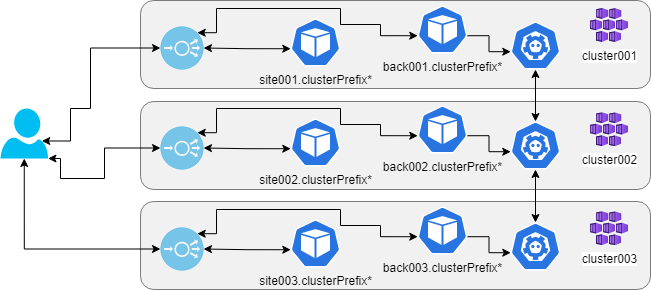
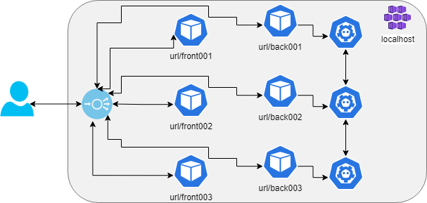

# `yuruna` peerkeys example

Key/value replication across nodes using [etcd](https://etcd.io/).

## End-to-end deployment

Below are the end-to-end steps to deploy the `peerkeys` project to `localhost` (assuming Docker is installed and Kubernetes enabled). The execution below is from the `automation` folder. You may need to start PowerShell (`pwsh`).

Before deploying, seek for `TO-SET` in the config files and set the required values. See section "Cloud deployment instructions".

**IMPORTANT**: Before proceeding, read the Connectivity section of the [Frequently Asked Questions](../../docs/faq.md).

- Create resources

```shell
./yuruna.ps1 resources ../examples/peerkeys localhost
```

- Build the components

```shell
./yuruna.ps1 components ../examples/peerkeys localhost
```

- Deploy the  workloads

```shell
./yuruna.ps1 workloads ../examples/peerkeys localhost
```

### Functionality validation

Basic validation can be done by opening the browser against two different endpoints.
Set a key/value pair in one of the endpoints.
Enter the key in another endpoint and press get. You should retrieve that same value.

## Resources

Terraform will be used to create the following resources:

- Registry: {componentsRegistry}
- Clusters and corresponding local context. For localhost deployments, copies of the default context will be created.

As output, the following values will become available for later steps:

- ${env:registryName}.registryLocation
- ${context.name}.clusterIp
- ${context.name}.frontendIp
- ${context.name}.hostname

## Components

- A Docker container image for a .NET C# website.
- A BFF (Backend For Frontend) component named grava.
- A Docker container image for a key-value storage service, using `etcd`.
- [NGINX Ingress Controller](https://kubernetes.github.io/ingress-nginx)
- Azure Kubernetes Service (AKS) [HTTP application routing](https://docs.microsoft.com/en-us/azure/aks/http-application-routing)

## Workloads

- The frontend/website will be deployed to each cluster.
- A component named grava, implementing a BFF (Backend For Frontend) API.
- The key-value storage service will be deployed to each cluster.
- Ingress controller and redirect rules are deployed to each cluster (once only in localhost).

## Cloud deployment instructions

- Confirm [requirements](../../docs/requirements.md)
- [Authenticate](../../docs/authenticate.md) with your cloud provider

### Azure

After authentication, deploy to Azure using the following sequence. Make sure those values `TO-SET` are globally unique. The example automates the steps to deploy components and expose services, as explained in the MSDN article [Up and Running with Azure Kubernetes Services](https://docs.microsoft.com/en-us/archive/msdn-magazine/2018/december/containers-up-and-running-with-azure-kubernetes-services).

```shell
./yuruna.ps1 resources ../examples/peerkeys azure
./yuruna.ps1 components ../examples/peerkeys azure
./yuruna.ps1 workloads ../examples/peerkeys azure
```
**IMPORTANT**: Remember to clean up the resources when no longer using them.

## Notes

Peerkeys exemplifies frontend, backend, and K8S "composing". In a cloud deployment, each cluster gets the ingress, which will expose the frontend site and the backend API from different endpoints, mapping to the internal services (via HTTP, port 80).



In a localhost, running all the components in the same cluster creates a collision for the ingress rules. That is solved by using a different "pathBase" for each instance. That results in a problem to enable the services to all operate from the same code, as explained in the blog post [.NET Core hosted on subdirectories in Nginx](https://www.billbogaiv.com/posts/net-core-hosted-on-subdirectories-in-nginx). The solution described there is used, and a single ingress controller maps paths to each internal container via the rules deployed to each namespace.



Back to main [readme](../../README.md). Back to list of [examples](../README.md).
