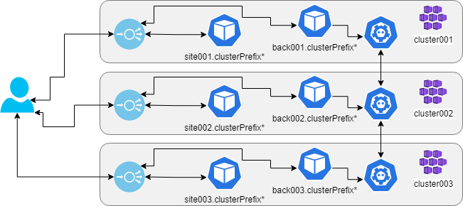
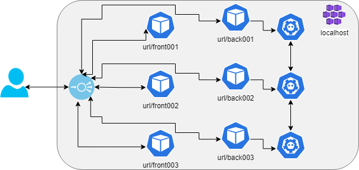

# `yuruna` peerkeys example

Replication of key-value pairs across clusters.

Follow the instructions to create resources, build components and deploy the workloads. Connect to one of the frontends. Endpoints are exposed during the workloads deployment.

## Search and replace

Reuse this project by search and replacing placeholders in case-sensitive mode.

- yrn42peerkeys-tags -> Resource tags. Example: yrn42

Despite the several placeholders enabling reuse in different configurations, it is recommended to replace as many valuables as possible to become identical, easing future maintenance. Replace `yrn42peerkeys-tags` first and then use this regular expression to search and replace the others:  `(yrn42peerkeys)[A-Za-z0-9\-]*`

Before deploying to the cloud environments, seek for `TO-SET` and set the required values. See section "Cloud deployment instructions".

## End to end deployment

Below are the end-to-end steps to deploy the `peerkeys` project to `localhost` (assuming Docker is installed and Kubernetes enabled). The execution below is from the `automation` folder. You may need to start PowerShell (`pwsh`).

- Create resources

```shell
./yuruna.ps1 resources ../projects/examples/peerkeys localhost
```

- Build the components

```shell
./yuruna.ps1 components ../projects/examples/peerkeys localhost
```

- Deploy the  workloads

```shell
./yuruna.ps1 workloads ../projects/examples/peerkeys localhost
```

### Functionality validation

Basic validation can be done by opening the browser against two different endpoints.
Set a key/value pair in one of the endpoints.
Enter the key in another endpoint and press get. You should retrieve that same value.

## Resources

Terraform will be used to create the following resources:

- Registry: {componentsRegistry}
- Clusters and corresponding local context: {yrn42peerkeys001}, {yrn42peerkeys002}, {yrn42peerkeys003}

As output, the following values will become available for later steps:

- ${env:registryName}.registryLocation
- ${context.name}.clusterIp
- ${context.name}.frontendIp
- ${context.name}.hostname

## Components

- A Docker container image for a .NET C# website.
- A Docker container image for a key-value storage API.
- [NGINX Ingress Controller](https://kubernetes.github.io/ingress-nginx)
- Azure Kubernetes Service (AKS) [HTTP application routing](https://docs.microsoft.com/en-us/azure/aks/http-application-routing)

## Workloads

- The frontend/website will be deployed to each cluster.
- The key-value storage API will be deployed to each cluster.
- Ingress controller and redirect rules are deployed to each cluster (once only in localhost).

## Cloud deployment instructions

These steps need be executed just once, unless you modify configurations.

- Confirm [requirements](../../../docs/requirements.md)
  - The PowerShell scripts do not verify that requirements are met.
- [Authenticate](../../../docs/authenticate.md) with your cloud provider
  - Instructions assume execution from a PowerShell prompt connected to the cloud account.

After authentication, deploy to Azure using the following sequence. Make sure those values `TO-SET` are globally unique.

```shell
./yuruna.ps1 resources ../projects/examples/peerkeys azure
./yuruna.ps1 components ../projects/examples/peerkeys azure
./yuruna.ps1 workloads ../projects/examples/peerkeys azure
```

## Notes

Peerkeys exemplifies frontend, backend, and K8S "composing". The example automates the steps to deploy components and expose services, as explained in the MSDN article [Up and Running with Azure Kubernetes Services](https://docs.microsoft.com/en-us/archive/msdn-magazine/2018/december/containers-up-and-running-with-azure-kubernetes-services). In a cloud deployment, each cluster gets the ingress, which will expose the frontend site and the backend API from different endpoints, mapping to the internal services (via HTTP, port 80).



In a localhost, running all the components in the same cluster creates a collision for the ingress rules. That is solved by using a different "pathBase" for each instance. That results in a problem to enable the services to all operate from the same code, as explained in the blog post [.NET Core hosted on subdirectories in Nginx](https://www.billbogaiv.com/posts/net-core-hosted-on-subdirectories-in-nginx). The solution described there is used, and a single ingress controller maps paths to each internal container via the rules deployed to each namespace.



Back to main [readme](../../../README.md). Back to list of [examples](../README.md).
